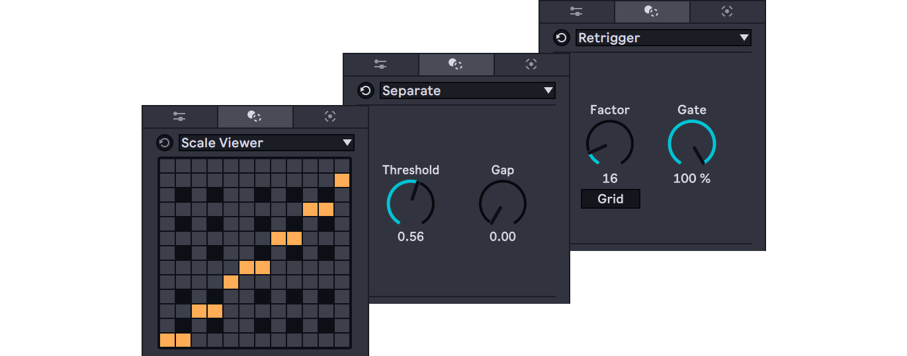

# Max for Live MIDI Tool Examples

## What is this?

Examples of Max for Live MIDI tools for Ableton Live 12.

## Examples

* [Retrigger Transform](retrigger-transform/README.md) : a simple transform tool with js.
* [Scale Viewer](scale-viewer/README.md) : just shows scale info like the classic Scale MIDI effect device.
* [Separate Transform](separate-transform/README.md) : a simple transform with only pure Max.

## Additional Information for M4L Developers
* [Memorandum of M4L development for MIDI Tools](memo/README.md) [(日本語)](memo/README_ja.md)
