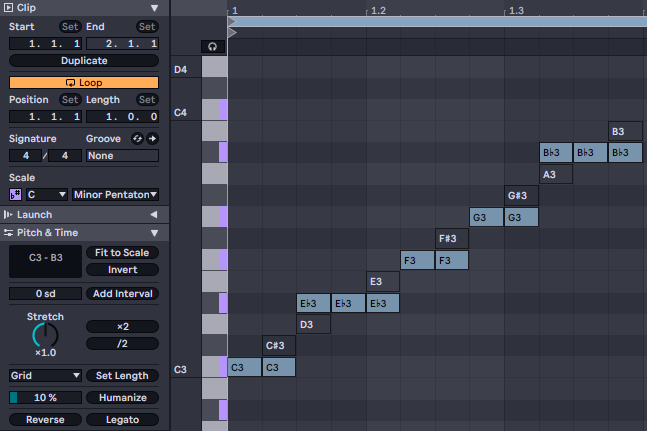
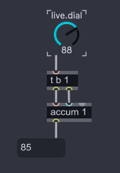
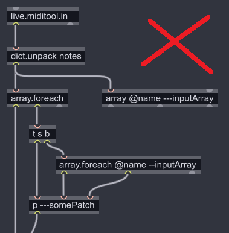
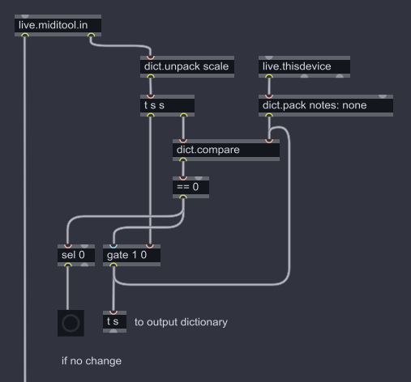
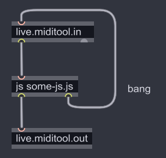

# Memorandum of M4L development for MIDI Tools

[日本語はこちら](README_ja.md)

## Differences between MIDI Tools and Classic Max for Live Devices
There are many benefits to using and developing MIDI Transformations/Generators.
* MIDI Tools can obtain information on notes within user selection much more easily than using Live Object Model (LOM) API.
* You can use MIDI Tools in the MIDI Clip View without changing to other view.
* By changing parameters of MIDI Tools, you can see the results of transformation/generation immediately.
* Classic MIDI Effect, which handles notes in real-time, devices cannot obtain the length of notes until receiving note off events. MIDI Tools can obtain the length of whole notes in the MIDI clip.
* Classic MIDI Effect often have the limit for the number of poly notes. (e.g. Bouncy Notes)<br>
MIDI Tools would handle 10, 20, or more notes at a time.<br>
There are further discussions in [Mind The Complexity!](#mind-the-complexity) section.

At the moment of June 2024, there are a few disadvantages for MIDI Tools. :(
* Parameters in MIDI Tools are not able to be automated. 
* MIDI Tools are not available for Push.
* MIDI Tools cannot use messages from Node for Max (as known as N4M, the `node.script` object) to trigger transform/generation. It is because the process of Max and inner Node.js are not synchronized. `jweb` is as the same.

## The Basics of MIDI Tool Development
[The official document](https://docs.cycling74.com/max8/vignettes/live_miditools) discusses the basics of MIDI Tool development.<br>
It is recommended to read it first before the further information below.<br>
The help patches of `live.miditool.in` and `live.miditool.out` object are also the fundamental examples of MIDI Tools with pure Max patch.

The note dictionaries from the first outlet of `live.miditool.in` are the same as of Clip class's `get_notes_extended` function in [LOM API](https://docs.cycling74.com/max8/vignettes/live_object_model).<br>
Also, be aware that `velocity` values are float.

The dictionary from the second outlet of `live.miditool.in` is like below.
``` JavaScript
{
  clip: {
    time_selection_start: 0.5,
    time_selection_end: 0.75,
    insert_marker_time: 0.5,
    first_note_start: 0.5,
    last_note_end: 0.75,
    lowest_pitch: 64,
    highest_pitch: 71
  },
  scale:  {
    scale_mode: 1,
    root_note: 0,
    scale_intervals: [0, 2, 4, 5, 7, 9, 11]
  },
  grid: {
    interval: 0.25,
    enabled: 1
  }
}
```
As the same as dictionaries in `notes`, the unit of time is beat. (1.0 = quarter note)<br>
`insert_maker_time` only appears when the user selects outside of any notes in MIDI clip.<br>
Further discussions on `scale` in [Fitting the Scale](#fitting-the-scale) section.

The built-in MIDI Tools seem to ignore if the `grid` was `enabled` but use the `interval` of `grid` whenever the length parameter was set to `Grid`. Thus `enabled` in `grid` might not matter in most cases.

## Fitting the Scale
We have scale context from `live.miditool.in` like below.
``` JavaScript
{
  // ...
  scale: {
    scale_mode: 1,
    root_note: 0,
    scale_intervals: [0, 2, 4, 5, 7, 9, 11]
  },
  // ...
}
```
This section discusses how to apply scale to notes with this information.

The easiest calculations for fitting notes to the scale are below.

$$
\begin{align}
\text{Let } N = \text{the original note} \\
R = \text{root}\underline{}\text{note} \\
L = \text{length of scale}\underline{}\text{intervals} \\
\text{Then } O = N \div 12 \\
S =[(N - R) \div 12]\div L \\
\text{The scaled note } N' \text{ is} \\
N' = S\text{th of scale}\underline{}\text{intervals} + R + 12 \cdot O
\end{align}
$$

However, this method is not equivalent for the behavior of "Fit to Scale" button in "Pitch and Time" of Live. Most cases live _Major_ scales  such as major

The scaled notes after Fit to Scale are a set of nearest note to scale note and the lowest note like below.



See [fit2scale.js](https://github.com/h1data/M4L-MIDI-tool-examples/blob/main/scale-viewer/code/fit2scale.js) in Scale Viewer sample device.<br>
You can easily get the scaled pitch number by `coll` with scale information.

## Mind the Complexity!

MIDI Tools handle much more notes at a time than classic MIDI Effect devices.<br>
The number will raise to 10, 20, 50 or more in a MIDI clip.<br>
Dealing with too much process, it might suffer the performance of Live.

Introduces factors which may lead to bad scenarios and those solutions in this section.

### Factor 1: cause many bangs in a short span

You can apply transform/generate on changing parameters by sending bang to `live.miditool.in`. Rotating `live.dial` with many steps causes a number of bangs to `live.miditool.in`.



### Factor 2: nests of loops

You might compare a note and other notes in the MIDI clip.
It is bad idea nests of `array.foreach` or `array.iter` like below.



The calculation complexity of a nest, a loop in a loop, is represented by $O(n^2)$.
It means if there are 3 notes in a MIDI clip, the patch compares $3^3 = 9$ times, if 10 notes then 100 times, if 20 notes then 400 times, and if 100 notes then the device compares 10,000 times.<br>
A nest of loops must be avoided because it is common there might be dozens of notes in a MIDI clip.

### Solution 1: limit the interval of bang

There is the `qlim` object to reduce interval of bang.
It would reduce the complexity but not solve the root of problems.

### Solution 2-1: sorting by `array.sort` to reduce the complexity

Sometimes, sorting order of items in arrays may reduce the complexity.
The complexity of `array.sort` is $O(n\log(n))$, and it is much less than $O(n^2)$. It should be used if the whole complexity is bigger than $O(n\log(n))$ because it is bigger than the typically cases; $O(n)$.

### Solution 2-2: execute only when dictionaries change

It costs to handle the array of input notes or the dictionary of scale but those are not varied in a short span.

`dict.compare` object can detect the changes of dictionary content like usual `change` object. 

You can execute heavier procedure only when the input array of notes or the dictionary of scale has been changed.

It can be implemented by `js`, but `dict.compare` would be more efficient because there are no deep comparison method in native methods of JavaScript and you have to iterate every element in objects.<br>
Off course, `dict.compare` object itself produces some computation costs.

_TODO_: research if we should use `@unordered`

## Using `js` Object
* `js` object can receive dictionary messages by the function named `dictionary()`. `dictionary [dict name]` message from outlets of `live.miditool.in` is a single symbol (string), however, it becomes a list of symbols after throughout prepend objects or message objects like `set $1`.

* In your JavaScript source, you can handle dictionaries of `live.miditool.in` as normal JavaScript objects like below.
``` JavaScript
function dictionary(dictName) {
  var inputDict = JSON.parse(new Dict(dictName).stringify());
  var outputArray = [];
  // some transform logic
  for (var i = 0; i < inputDict.notes.length; i++) {
    outputArray.push( {
      // pitch: ..., start_time: ..., duration: ...
    } );
  }
  var outputDict = new Dict();
  outputDict.parse(JSON.stringify({notes: outputArray}));
  outlet(0, outputDict);
}
```

* When input values from UI parameters, don't send bang directly from UI parameters, but send from `js` like below.



## Error Messages
If the MIDI Tool M4L is in trouble, error messages are shown in the status bar of of Live.

### "Did not receive a Note dictionary in time. Make sure that the dictionary is synchronous."
It's the most common message during MIDI tool developments. It appears when `live.miditool.out` received no dictionary messages although `live.miditool.in` has sent a note message.<br>
It would appear when `live.miditool.out` receives a message which was not a dictionary one, too.

### "The Note dictionary received from Max was malformed: The key `<key name>` is missing."
As it says, it appears when the dictionary sent to `live.miditool.out` has no essential items; `notes` of top level, `pitch`, `start_time`, or `duration` in a note item in array of `notes`.

### "Received a Note dictionary asynchronously. Make sure that the dictionary is synchronous."
It appears when `live.miditool.out` receives dictionary messages when no input from `live.miditool.in`.<br>
The author has encountered this message when trying to output from messages from `jweb` object.

## Miscellaneous
* You can not open Max Window from the UI of MIDI Tools, however, you can see the print outputs by a Max Window window which is opened from usual M4L Instrument, MIDI effect, or Audio effect devices.<br>
(update) While Live 12.0.5, you can open Max window with keyboard shortcut. ([Release Notes](https://www.ableton.com/release-notes/live-12/#Live12.0.5PublicReleaseNotes(WIP)-MaxforLive))

* You can obtain the global scale settings by LOM API with `get root_note`, `get scale_name`, and `scale_intervals` from path `live_set`.

* You can use the picture `scale.svg` in Max for scale-switching button. Other than the scale pic, there are new 60 SVG files added in Max 8.6. <br>
See `pictures` page in the help patch of `live.tab` for built-in SVG files.

# References

## Official Documents

### Ableton Live 12 Reference Manual
* [MIDI Tools](https://www.ableton.com/en/live-manual/12/midi-tools/) 

### Max 8 Documentation
* [Max for Live MIDI Tools](https://docs.cycling74.com/max8/vignettes/live_miditools)
* The help patches of `live.miditool.in` and `live.miditool.out`
* [LOM - The Live Object Model](https://docs.cycling74.com/max8/vignettes/live_object_model)

## Other Resources

* [Building a Live 12 MIDI Transformer with Arrays in Live 12](https://www.youtube.com/watch?v=CK_-lEuuPkI)
