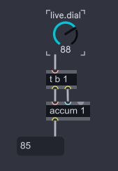
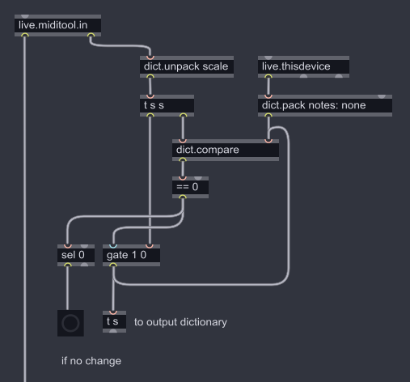

# (Japanese) MIDIツールM4L開発メモ 

[switch on English](../README.md)

## MIDIツールと従来のMIDIエフェクトとの違い

MIDI生成／変形ツールを開発することには多くの利点があります。
* MIDIツールはLive Object Mode (LOM) APIを使用する場合より簡単にユーザが選択した範囲のノート情報を取得できます。
* MIDIツールはMIDIクリップ編集中に、ビューを切り替えずに使用できます。
* MIDIツールのパラメーターを変更すると、すぐに生成／変形処理の結果がわかります。
* MIDIノートをリアルタイムで処理する従来のMIDIエフェクトには、ノートオフのイベントを受信するまでノートの長さを知る術がありません。MIDIツールでは、長さを含むMIDIクリップ内すべてのノート情報を取得できます。
* 従来のMIDIエフェクトは、一度に扱う和音数を制限している（Bouncy Notesなど）ものがありますが、MIDIツールでは一度に扱うノート数は10、20、またはそれ以上になり得ます。<br>
[計算量に注意！](#計算量に注意)の章で詳しく扱います。

2024年6月時点で、MIDIツールにはいくつか制限事項があります。
* MIDIツールのパラメーターにはオートメーションを設定できません。（Live 12.1で、M4Lではない標準デバイスではパラメーターをMIDIマップ可能になるとのこと）
* MIDIツールはPushで使用できません。
* MIDIツールはNode for Max（N4M、`node.script`オブジェクト）から出力されるメッセージをトリガーにノート情報を生成／変形できません。MaxのプロセスとNode.jsのプロセスが非同期であるためで、`jweb`についても同様です。

## MIDIツール開発の基本
[公式ドキュメント](https://docs.cycling74.com/max8/vignettes/live_miditools)に、MIDIツール開発の基本が紹介されています。
以降の内容に進む前に、まず一読されることをお勧めします。また、`live.miditool.in` と `live.miditool.out` オブジェクトのヘルプパッチにMax標準オブジェクトを用いた基本的なMIDIツールの例があります。

`live.miditool.in` オブジェクトの第1アウトレットから出力されるノート情報は、[LOM API](https://docs.cycling74.com/max8/vignettes/live_object_model) の `get_notes_extended` ファンクションで取得できる内容と同じです。<br>
また、`velocity` は小数点以下があることに注意です。

`live.miditool.in` オブジェクトの第2アウトレットから出力されるdictionaryの内容は以下のようになっています。
``` JavaScript
{
  clip: {
    time_selection_start: 0.5,
    time_selection_end: 0.75,
    insert_marker_time: 0.5,
    first_note_start: 0.5,
    last_note_end: 0.75,
    lowest_pitch: 64,
    highest_pitch: 71
  },
  scale:  {
    scale_mode: 1,
    root_note: 0,
    scale_intervals: [0, 2, 4, 5, 7, 9, 11]
  },
  grid: {
    interval: 0.25,
    enabled: 1
  }
}
```
`notes`と同様に、時間の単位は拍（1.0=四分音符）になります。<br>
`insert_marker_time` はMIDIクリップ画面でノート以外を選択した場合のみ出現します。<br>
`scale` については[スケールに合わせる](#スケールに合わせる)の章で詳しく取り上げます。

標準のMIDIツールでは、`grid`の`enabled`（有効/無効）の値に関わらず、長さのパラメーターが `Grid` に設定されると`grid` の `interval` の長さを使用するようです。`grid` の `enabled` はほとんどの場合無視できると言えます。

## スケールに合わせる
`live.miditool.in` から取得するスケール情報は以下のとおりです。
``` JavaScript
{
  // ...
  scale: {
    scale_mode: 1,
    root_note: 0,
    scale_intervals: [0, 2, 4, 5, 7, 9, 11]
  },
  // ...
}
```
この章では、この情報からどうやってスケールに合わせるかを解説します。

最も簡単なのは、以下の様な計算式を用いる方法です。
$$
\begin{align}
N = \text{オリジナルのノート番号} \\
R = \text{root}\underline{}\text{note} \\
L = \text{scale}\underline{}\text{intervalsの長さ} \\
\text{とした場合、 } O = N \div 12 \\
S =[(N - R) \div 12]\div L \\
\text{スケールに合わせたノート} N' \text{は} \\
N' = S\text{th of scale}\underline{}\text{intervals} + R + 12 \cdot O
\end{align}
$$

しかしながら、この計算方法は "Fit to Scale" ボタンを押した場合の結果とは一致しません。
メジャースケールのような*メジャー*なスケールは問題ありませんが、ペンタトニックスケールなど音の間が3半音以上離れる場合に
結果が変わってきます。

Fit to Scaleボタンを押した場合は、以下の様に元のノートに最も近いスケールのノートのうち、低い方のノートに合わせられます。


実際の実装例についてはScale Viewerの[fit2scale.js](https://github.com/h1data/M4L-MIDI-tool-examples/blob/main/scale-viewer/code/fit2scale.js)を参照してください。<br>
このスクリプトによって、スケール情報に合わせたピッチ番号を`coll`オブジェクトから簡単に取得できます。

## 計算量に注意！

MIDIツールは従来のMIDIエフェクトよりも大量のノート情報を扱います。<br>
MIDIクリップ中のノート数は10、20、50、またはそれ以上におよぶ場合があるため、多くの情報を一度に処理しようとした結果、Live本体のパフォーマンスに影響を及ぼす可能性があります。

この章では、いくつかの良くない事例とその対処法について取り上げます。

### 事例1: 短い時間で大量のbangが発生

パラメーターを変更した際に生成／変形を実行するには `live.miditool.in` にbangを送ります。
ステップ数が多い`live.dial` でノブを回すと、大量のbangが発生します。



### 事例2: ループの入れ子

MIDIクリップの中で、あるノートの情報と他のノートの情報を比較したい時があると思います。
このとき、以下の様な`array.foreach`や`array.iter`の入れ子を作ることは避けなければいけません。


ループの中にループがあるような入れ子状態の計算量は$O(n^2)$と表されます。
これは、もし3個のノートがあった場合$3^3 = 9$回、10個あった場合は100回、
20個あった場合は400回、100個あった場合は10,000回比較処理が行われてしまうことを意味します。

### 対処法1: bangの間隔を制限する

`qlim`オブジェクトで、bangを送信する間隔を制限できます。
計算の頻度を減らすことはできますが、処理量を根本から減らす積極的な対処とは言えません。

### 対処法2-1: array.sortで並び替えることで計算量を抑える

Arrayの中の要素を並び替えておくことで、計算量を減らせる場合があります。<br>
`array.sort` オブジェクトの計算量は$O(n\log(n))$[^1]であり、$O(n^2)$に比べて計算量がかなり少なくなります。
最も単純な$O(n)$よりは多くなるため、この方法は全体の計算量が$O(n\log(n))$を上回る場合のみ使うべきです。

### 対処法2-2: dictionaryが変わった時だけ処理する

ノート情報のarrayやスケール情報のdictionaryは処理が複雑になりがちですが、パラメーターの変更に比べて更新の頻度は少なくなります。

`dict.compare` オブジェクトを使うことで、従来の`change`オブジェクトの様にdictionaryの内容が変化したことを検知できます。



これによって、入力されたノート情報のarrayやスケール情報のdictionaryが変わった時だけ重い処理を実行させることができます。<br>
`js`でも実装できますが、JavaScriptにはオブジェクトを比較するネイティブメソッドがなく内部の要素を走査する必要があるため、`dict.compare`の方が効率が良いと考えられます。[^2]<br>
もちろん、`dict.compare`オブジェクト自体処理は生じるので常に使用すればよいというわけではありません。

_TODO_ `@unordered`を使うべきかどうか調査。

## `js`オブジェクトを使う場合

* dictionaryのメッセージを`js` オブジェクトで受信した場合、`function dictionary(dictionaryの名前)`という関数が実行されます。
`live.miditool.in` から出力されるメッセージは `dictionary [dictionaryの名前]` という形式になり、引数は1つのシンボル（文字列）になりますが、`prepend` オブジェクトや`setParam $1`といったメッセージを通した場合、引数はシンボルのリストになることに注意です。

* JavaScriptのソースでは、`live.miditool.in`からのdictionaryを以下の様に通常のJavScriptオブジェクトとして扱うことができます。

``` JavaScript
function dictionary(dictName) {
  var inputDict = JSON.parse(new Dict(dictName).stringify());
  var outputArray = [];
  // 変形処理
  for (var i = 0; i < inputDict.notes.length; i++) {
    outputArray.push( {
      // pitch: ..., start_time: ..., duration: ...
    } );
  }
  var outputDict = new Dict();
  outputDict.parse(JSON.stringify({notes: outputArray}));
  outlet(0, outputDict);
}
```

* UIパラメーターの値が変わった場合、UIオブジェクトからbangを送るのではなく、
以下の様にUIから変更された値を受け取った`js`から送る必要があります。


## エラーメッセージ
MIDIツールで問題が発生した場合、Live下部のステータスバーにエラーメッセージが表示されます。

### ディクショナリーのノートを時間内に受信できませんでした。ディクショナリーが同期していることを確認して下さい。
(Did not receive a Note dictionary in time. Make sure that the dictionary is synchronous.)<br>
これはMIDIツール開発中に最も遭遇するメッセージです。<br>
`live.miditool.in`からノートメッセージが出力されたにも関わらず、`live.miditool.out`にノートメッセージを受け取っていない場合に表示されます。<br>
また、`live.miditool.out`に送信するメッセージがdictionary以外だった場合にも表示されます。

### Maxから受信したノートディクショナリーが不完全です: キー"`キーの名前`"が見つかりません。
(The Note dictionary received from Max was malformed: The key `<key name>` is missing.)<br>
メッセージのとおり、`live.miditool.out`に出力されたdictionaryに必要な要素がない場合に表示されます。`notes`はトップレベルの要素として必要で、`notes`内のarrayに格納されるdictionaryには、それぞれ`pitch`、`start_time`、および`duration`が必要です。

### ディクショナリーと同期していないノートを受信しました。ディクショナリーが同期していることを確認して下さい。
(Received a Note dictionary asynchronously. Make sure that the dictionary is synchronous.)<br>
`live.miditool.in`からの入力が無いにも関わらず`live.miditool.out`にdictionaryメッセージを送信した場合に表示されます。<br>
`jweb`を利用しようとした際に、`jweb`から出力したメッセージを`live.miditool.out`に出力した場合も表示されます。

## その他

* MIDI生成／変形ツールからMaxウィンドウを開くことはできませんが、従来のM4Lデバイスから開いたMaxウィンドウから、MIDI生成／変形ツール内のprintオブジェクトなどで出力される内容を確認できます。<br>
（更新）Live 12.0.5で、Maxウィンドウを開くキーボードショートカットが追加されました。（[リリースノート](https://www.ableton.com/release-notes/live-12/#Live12.0.5PublicReleaseNotes(WIP)-MaxforLive)）

* グローバルスケールの設定はLOM APIの `live_set` パスに追加された `get root_note`、`get scale_name`、および `get scale_intervals` で取得できます。

* スケール設定の切り替えスイッチ用に、画像ファイル `scale.svg` がMaxに内蔵されています。それ以外にもMax 8.6では60もの内蔵SVGファイルが追加されています。<br>
内蔵SVGファイルは`live.tab`オブジェクトの`pictures`ページから確認できます。

# 参考資料
## 公式ドキュメント
* [Max for Live MIDI Tools](https://docs.cycling74.com/max8/vignettes/live_miditools)
* `live.miditool.in` および `live.miditool.out` オブジェクトのヘルプパッチ
* [LOM - The Live Object Model](https://docs.cycling74.com/max8/vignettes/live_object_model)

## その他の資料

* [Building a Live 12 MIDI Transformer with Arrays in Live 12](https://www.youtube.com/watch?v=CK_-lEuuPkI)

[^1]: パッチ[array-sort-computation.maxpat](examination-patches/array-sort-computation.maxpat)を参照
[^2]: パッチ[dict-change-benchmark.maxpat](examination-patches/dict-change-benchmark.maxpat)を参照