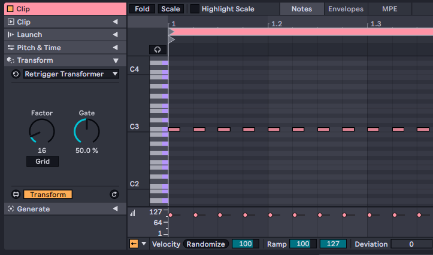

# Retrigger Transformer

## What is this?

A simple example of a MIDI Transformer which is the new feature of Ableton Live 12 with Max for Live.

It divides notes by `Factor` note length.

## Attention!
**!!! This device is not for practical music workflow !!!**

Built-in `Arpeggiate` Transformer can perform as same as this device by setting `Distance` to 0sd.

## Dependency Environments
Ableton Live 12 / Max 8.6 or later

## Usage

1. Download from Retrigger Transformer.amxd link above or the link [here](https://github.com/h1data/M4L-retrigger-transformer/raw/main/retrigger-transform/Retrigger%20Transformer.amxd).

2. Put the amxd file somewhere under your Live user library folder.

3. Now you can select Retrigger Transformer from `User:` in Transform pane of MIDI clips.

## Parameters

* `Factor` 
Represents the interval of transformed notes. 4 is for a quarter note.

* `Grid` 
When enabled, target notes are divided with the grid of the current MIDI clip. 
The `Factor` setting would be ignored.

* `Gate` 
The duration of transformed notes in percent of `Factor` length.
