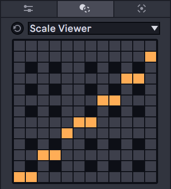

# Scale Viewer

## What is this?
Just shows scale info like traditional Scale MIDI effect device.
Applying transform will fit notes to the scale.

## Requirements
Ableton Live 12 Suite / Max 8.6 or later

## Download
(link will appear after the commit)

## Parameters
This device has no parameter.
