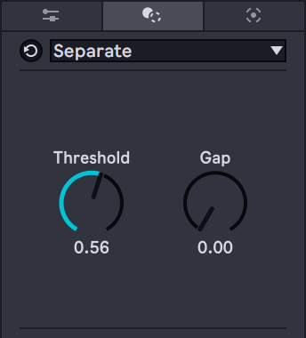

# Separate Transformer

## What is this?

A simple example of a MIDI Transformer which is the new feature of Ableton Live 12 with Max for Live. 
The complete device which was made in [Ableton and Max Community Japan workshop](https://amcj-050.peatix.com/).

## Requirements
Ableton Live 12 Suite / Max 8.6 or later

## [Download](https://github.com/h1data/M4L-MIDI-tool-examples/raw/main/separate-transform/Separate.amxd)

## Parameters

* `Threshold` 
Adjusts how close the two notes on the same pitch must be determined to be connected. 
1.0 = the length of a quarter note.

* `Gap` 
Adjusts how far will the first note of connected notes be shortened. 
1.0 = the length of a quarter note.
